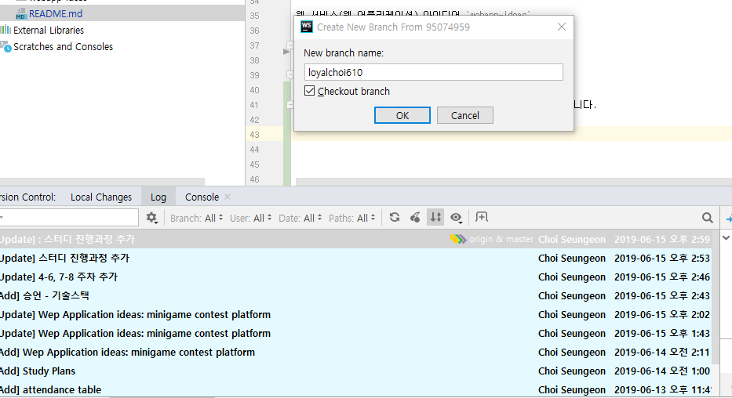
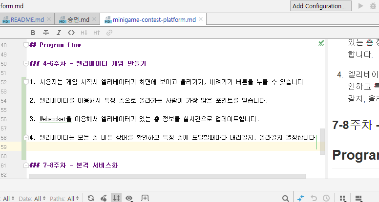
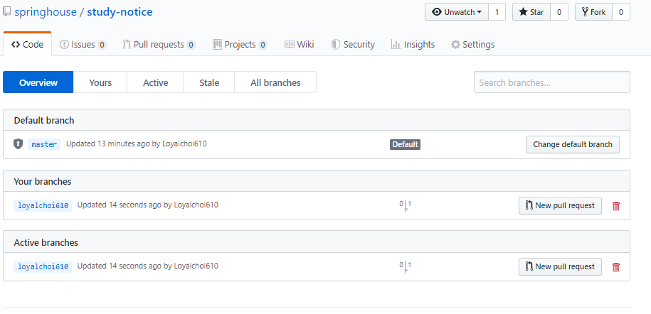
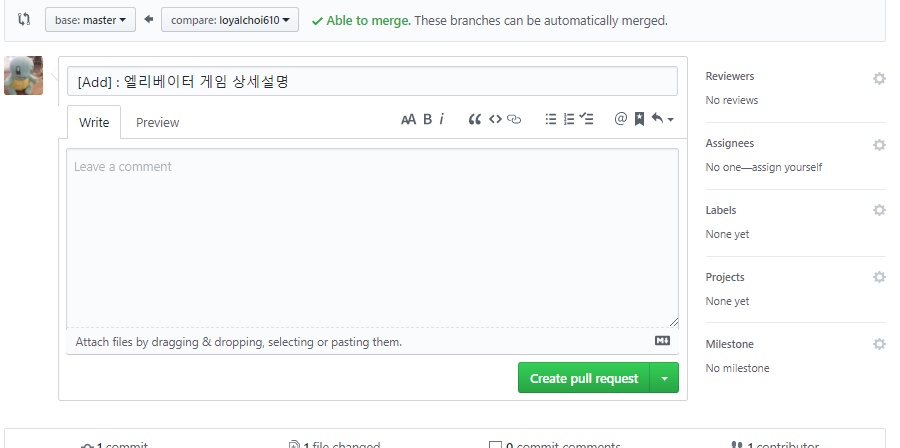
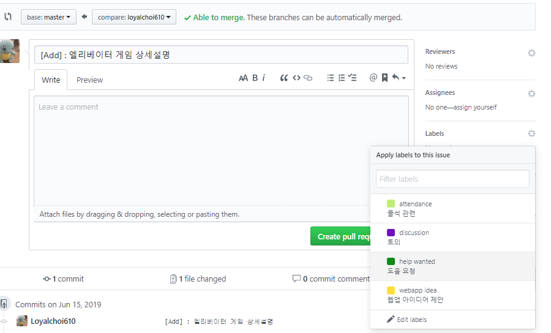
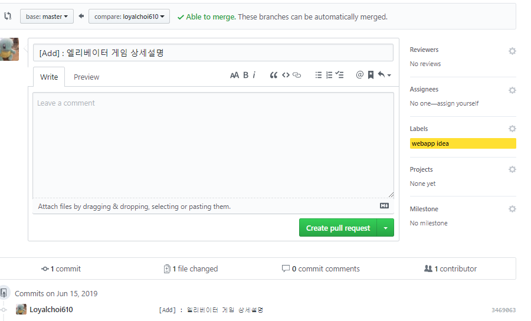

# study-notice

##오픈채팅방 링크
https://open.kakao.com/o/gVyqu4rb

## 출석부

|      Name     |  1 |  2 | 3  | 4 | 5 | 6 | 7 | 8 |
|:-------------:|:---:|:---:|----|---|---|---|---|---|
| [@loyalchoi610]( https://github.com/loyalchoi610)| ✔| ❌ | ＊ | * | * | * | * | * |

**불참 3회 시 스터디에서 제외**
 

## 스터디 진행 & 계획(짜는중👦 👧 👩 👨)

### 진행 시나리오

1. 만나기전 study-report 폴더 내 .md 파일을 만들어 발표자료(스터디하면서 공부했던 내용) 정리해오기

2. 한명씩 돌아가면서 study-report에 있는 내용을 토대로 편하게 발표

3. 스터디 질문 및 피드백

4. 프로젝트 기능 역할 분담 회의

### 일정

|      Week     |  Content | 
|:-------------:|:---:|
|1-2|orientation & warming-up project|
|3-4|CRUD operation & Restful api service|
|5-6|External API Integration|
|7-8|Other Spring Features|

## Contribution 

### 항목

웹 서비스(웹 어플리케이션) 아이디어 `webapp-ideas`

기술스택(스터디원 작성 필수) `member-introduction`

### 가이드

원격 repo와 master를 일치시킨 상태에서 branch를 하나 생성합니다.

저는 `webapp-ideas` 에 있는 `minigame-contest-platform` 엘리베이터 게임 상세설명을 채워 넣었습니다.

커밋을 하고 다음과 같은 형식으로 커밋 메세지를 작성합니다.

원격 레포에 push하면 다음과 같이 **자동**으로 원격 레포에 branch가 생성된 것을 확인할 수 있습니다.

pull request를 누르면 밑의 화면이 나오는데요,

다음과 같이 미리 만들어놓은 라벨 태그를 다실 수 있습니다.

우측 하단에 라벨이 생성된 것을 확인하셨으면 바로 밑에 녹색 버튼을 눌러주시면 되겠습니다.

