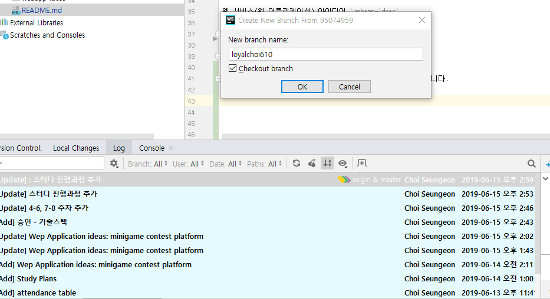
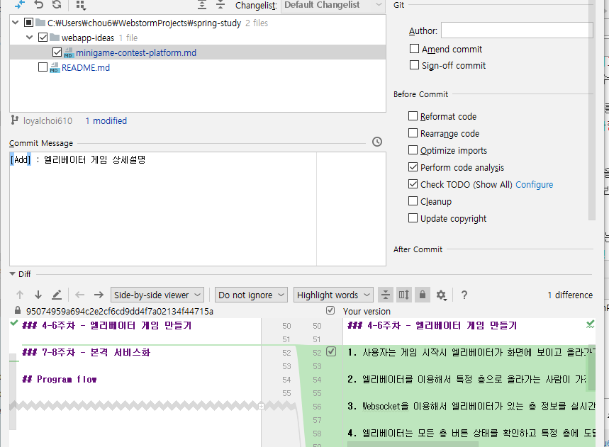
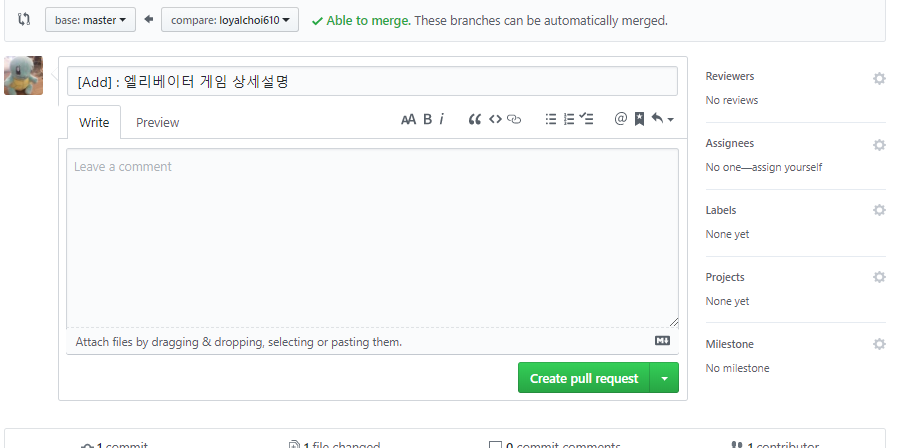
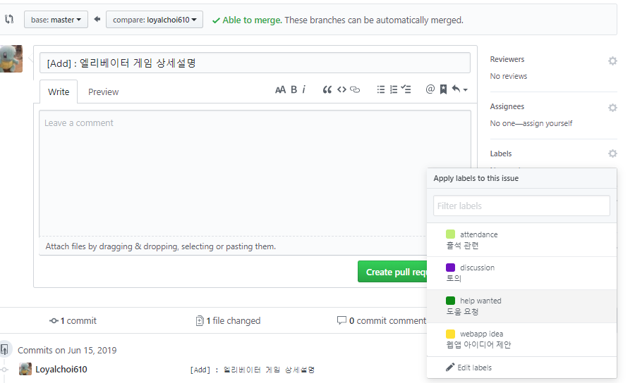

### 항목

`webapp-ideas` - 웹 서비스(웹 어플리케이션) 아이디어

`member-introduction` - 스터디원분들 기술스택

### 가이드

원격 repo와 master를 일치시킨 상태에서 branch를 하나 생성합니다.

저는 `webapp-ideas` 에 있는 `minigame-contest-platform` 엘리베이터 게임 상세설명을 채워 넣었습니다.

커밋을 하고 다음과 같은 형식으로 커밋 메세지를 작성합니다.

원격 레포에 push하면 다음과 같이 **자동**으로 원격 레포에 branch가 생성된 것을 확인할 수 있습니다.

pull request를 누르면 밑의 화면이 나오는데요,

다음과 같이 미리 만들어놓은 라벨 태그를 다실 수 있습니다.

우측 하단에 라벨이 생성된 것을 확인하셨으면 바로 밑에 녹색 버튼을 눌러주시면 되겠습니다.

